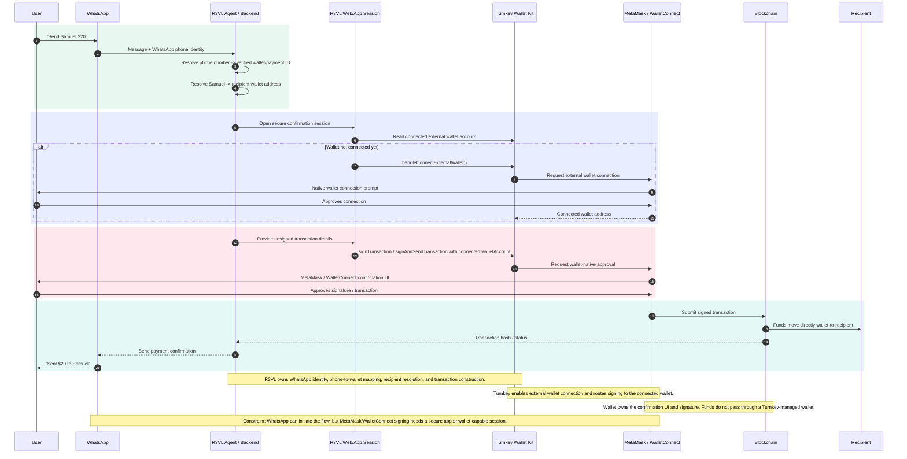

# R3VL + Turnkey Swimlane

## Takeaway

R3VL can keep the requested non-custodial, bring-your-own-wallet flow. Turnkey supports the external wallet connection and signing layer; R3VL owns the WhatsApp identity, recipient resolution, and transaction orchestration.

The only implementation constraint is that WhatsApp cannot directly open the MetaMask confirmation UI. The clean pattern is a secure R3VL web/app session where the connected wallet signs and funds move directly from the user's wallet to the recipient.
